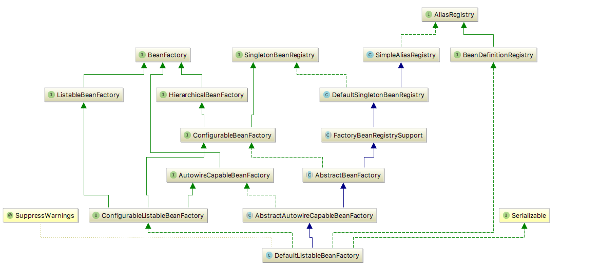

# 1. 容器的基本实现
## 1.1. 容器基本用法
## 1.2. Spring的结构组成
### 1.2.1. beans包的层级结构
### 1.2.2. 核心类介绍
#### 1.2.2.1. DefaultListableBeanFactory
&emsp;DefaultListableBeanFactory是整个bean加载的核心部分，是Spring注册及加载bean的默认实现。

#### XmlBeanDefinitionReader
&emsp;XML配置文件的读取是Spring的重要功能，因为Spring 的大部分功能都是以配置作为切人点的。

#### 容器的基础XmlBeanFactory
&emsp;先来分析以下代码实现的功能：BeanFactory beanFactory = new XmlBeanFactory(new ClassPathResource("beanFactoryTest.xml"));

#### 配置文件封装